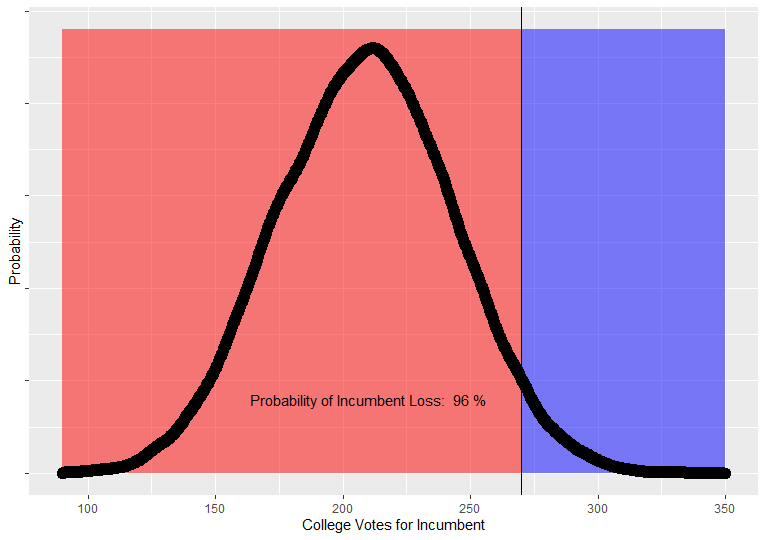
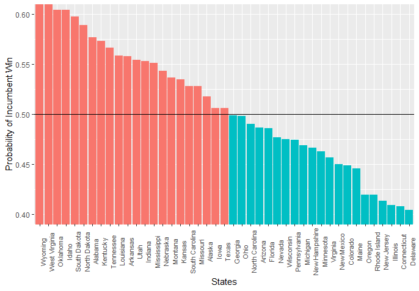

```{r setup, include=FALSE}
knitr::opts_chunk$set(echo = TRUE)

```





## Introduction

Come Presidential Election season in the USA, we most often hear that candidate A is X number of point ahead of their opponent. 
This is typically just the number of percentage points different between the two parties in national polls. Of course, if you think about it, you'll realize this means very little for who will win the Presidency, because this doesn't account for the Electoral College - the means by which the States select the President. 

In this article, we'll demonstrate a simple means of taking polling data, and converting it into a metric which does take the Electoral system into account:

We're going to calculate the probability of the incumbent's electoral victory, based on State polls. 

It is timely for us to use the polling data on the 2020 Presidential election as a test. 

Here's our raw data source: https://projects.fivethirtyeight.com/2020-election-forecast/

Note that we shouldn't expect our result to be an accurate forecast, because most validated forecasts involve some very sophisticated weighting and methodological choices we are not using. We're just trying to show what we could expect if the polls by State were representative, which is a bit more indicative of the probable result than national polling averages. 

Now we step through our R pipeline...

```{r, message = FALSE, warning= FALSE}

library(dplyr)
library(ggplot2)

## Set the date used to filter out polls taken before this day
AFTER_DATE = "01/09/20"

## Get raw data set. 
rawData = read.csv(url("https://projects.fivethirtyeight.com/polls-page/president_polls.csv"), na.strings=c("", "NA"))

## Filter out responses for independent candidates and polls which were not state specific. 


subSet = filter(rawData, !is.na(state) & answer %in% c("Biden","Trump")) %>%
  ## Add derived columns which is the number of individuals who responded for each row
  mutate(votes =  sample_size * (pct/100)) %>%
  ## Filter out the polls taken after the end date
  filter(end_date > AFTER_DATE) %>%
  ## Order the table so that each pair of rows for results from the same poll appear paired together. 
  group_by(question_id) 

## There are a number of polls that only have one response in the data, this inflates Republican numbers. 
## We filter to only include polls with have responses for both candidates.  

questionIDFilter = subSet %>% summarize(count = n()) %>% filter(count == 2)

subSet = filter(subSet, question_id %in% questionIDFilter$question_id )

Data = summarize(group_by(subSet, state, answer), total_votes = sum(votes))

head(Data,10)

## We need to convert our data into a table where each row is a state and our 
## columns show the polling vote share for each 
## candidate. Then, we derive columns for statistical data such as the 
## standard deviation and the probability of the incumbent
## making 50% or more votes from the population, given what we know of that 
## population from our sample. 

bidenVotes = filter(Data, answer == "Biden")
trumpVotes = filter(Data, answer == "Trump")

pollingData = merge(x = bidenVotes, y = trumpVotes, by = "state", all = TRUE) %>% 
  select(state, total_votes.x, total_votes.y) %>% 
  rename(biden_votes = total_votes.x, trump_votes = total_votes.y) %>%
  mutate(sample_size = biden_votes + trump_votes) %>%
  mutate(incumbent_pct = trump_votes / sample_size) 

## In order to calculate standard deviation, and therefore the probability of 
## an incumbent win in each state,
## We have to pass to the 'sd' function, an array of 0s and 1s which represent 
## every individuals response, with 0 being a vote for the challenger and 1 
## being a vote for the incumbent.

pollingData$std = 0.0
for (row in 1:nrow(pollingData))
{
  pollingData[row, "std"] = sd(c(rep(0, times = pollingData$biden_votes[row]) , rep(1, times = pollingData$trump_votes[row])))
}
pollingData$incumbent_win_probability = pnorm(0.5, mean = pollingData$incumbent_pct, sd = pollingData$std, lower.tail = FALSE)
pollingData$incumbent_loss_probability = 1 - pollingData$incumbent_win_probability


head(select(pollingData,state, incumbent_pct,std,incumbent_win_probability),10)

## Importing data on electoral college numbers. I made a simple CSV file with
## The name of each state and their number of electoral college votes. 

electoral_colleges = read.csv("Electoral_College_Votes_Per_State.csv", na.strings=c("", "NA")) %>%
  rename(state = ï..State) 
election_forecast_data = merge(x = electoral_colleges, y = pollingData %>% select(state, incumbent_win_probability) , by = "state", all = TRUE) %>%
  filter(!is.na(Number_Of_Votes))

head(election_forecast_data,10)

## Election simulations. We use the probability of incumbent win for each state 
## to make a series of weighted coin tosses and give
## the incumbent the corresponding number of seats. Over our many simulations, 
## we will get a distribution of the possible outcomes.

NUMBER_OF_SIMULATIONS = 20000
SAMPLE_SIZE = 100
SimulationIncumbentSeatsWon = c()
for(i in 1:NUMBER_OF_SIMULATIONS)
  {
  SimulatedIncumbentColleges = 0;
  SimulationResults = c()
  SimulationVoteShare = c()
  
  for (row in 1:nrow(election_forecast_data))
  {
    state_simulation = sample(c(0, 1), size = SAMPLE_SIZE,  replace = TRUE, prob = c(election_forecast_data$incumbent_win_probability[row], 1 - election_forecast_data$incumbent_win_probability[row]))
    SimulationVoteShare = append(SimulationVoteShare, mean(state_simulation))
    if(mean(state_simulation) <= 0.5){
      SimulationResults = append(SimulationResults, election_forecast_data$Number_Of_Votes[row])
    }
    else{SimulationResults = append(SimulationResults, 0)}
  }
  SimulatedIncumbentColleges = sum(SimulationResults)
  SimulationIncumbentSeatsWon = append(SimulationIncumbentSeatsWon, SimulatedIncumbentColleges)
}

## Visualize the results in 'SimulationResults' as you see fit
```
## Probability of Incumbent's Win

```{r, message = FALSE, warning= FALSE, echo=FALSE}
## Visualizations

Probability_Incumbent_Win = pnorm(270, mean = mean(SimulationIncumbentSeatsWon), sd = sd(SimulationIncumbentSeatsWon), lower.tail = FALSE) %>% round(2)
Probability_Incumbent_Lose = 1 - Probability_Incumbent_Win %>% round(2)

Probability_Incumbent_Win = Probability_Incumbent_Win * 100
Probability_Incumbent_Lose = Probability_Incumbent_Lose * 100

input = data.frame(SimulationIncumbentSeatsWon)
d <- ggplot(input, aes(x=SimulationIncumbentSeatsWon, size = 1)) + 
  annotate("rect",xmin=270, xmax=350, ymin=0, ymax=0.012, fill="blue",alpha=0.5 ) +
  annotate("rect",xmin=90, xmax=270, ymin=0, ymax=0.012, fill="red",alpha=0.5 ) +
  geom_density() + xlab("College Votes for Incumbent") + ylab("Probability")+ geom_vline(xintercept = 270) + 
  annotate("text", x = 210, y = 0.002, label = paste("Probability of Incumbent Loss: ", Probability_Incumbent_Lose, "%"))+
  theme(axis.text.y=element_blank(),legend.position = "none")
d
  

input = election_forecast_data %>% 
  arrange(incumbent_win_probability) %>%
  select(state, incumbent_win_probability) %>%
  mutate(Color = ifelse(incumbent_win_probability > 0.5, "red", "steel blue"))

b <- ggplot(input, aes(x = reorder(state, -incumbent_win_probability), y = incumbent_win_probability, fill = Color)) + 
  geom_bar(stat="identity") + 
  theme(axis.text.x=element_text(size=8, angle=90),legend.position = "none") +
  xlab("States") + ylab("Probability of Incumbent Win") 
b + geom_hline(yintercept = 0.5)
```


